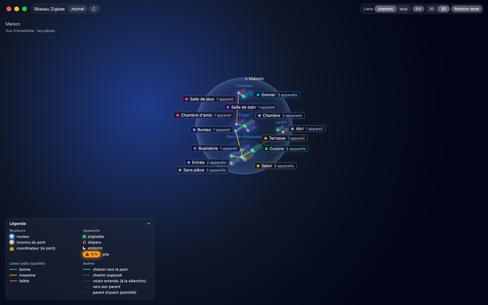
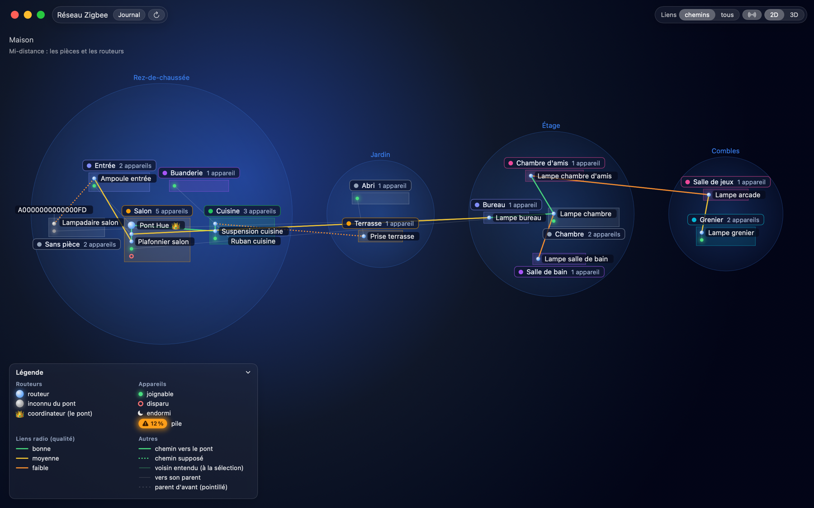
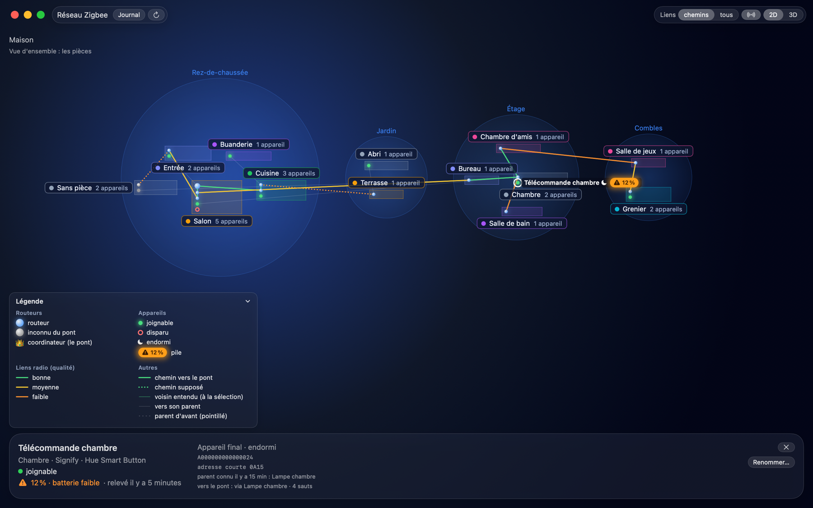
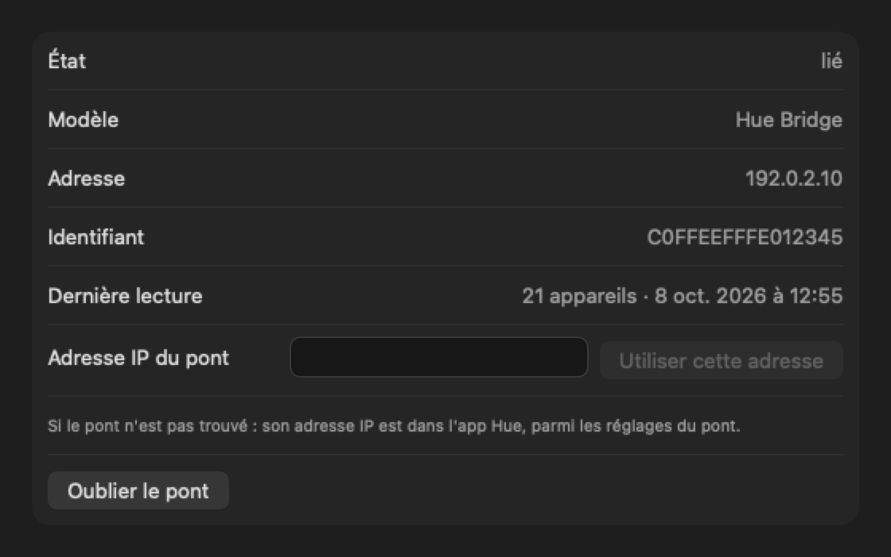
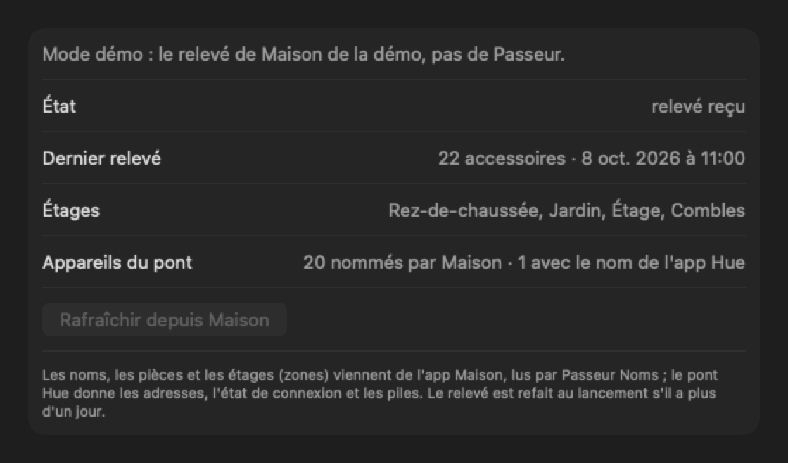

**English** · [Français](README.fr.md)

# Maillage Zigbee

<p align="center"></p>

<p align="center">
  
  
</p>

<p align="center">
  
  
</p>

<p align="center"><sub>Demo mode: a made-up Hue network, with made-up names, rooms and addresses.</sub></p>

Native macOS menu bar app (SwiftUI) that shows the Zigbee mesh of a Philips
Hue network: which lamp talks to which, with what link quality, and the path
each router's messages really take to the bridge. The Hue bridge doesn't say
any of that. A probe, an ESP32-C6 that joins the Hue network as an end device
and is plugged into the Mac over USB, reads the neighbor and routing tables of
every router; the bridge, through its local API, gives the devices and their
state; the Home app, read by Passeur Noms, gives their names, their rooms and
the floors. The app keeps a log of changes (a router gone, a device
that changes parent or loses it) and notifies the alerts.

The repository holds the app, the probe firmware (`sonde/`) and their tools.
The app derives from [Maillage Thread](https://github.com/Djoko-cli/maillage-thread),
the same app for a Thread network.

## Installing

Download `Maillage-Zigbee-X.Y.Z.dmg` from the latest
[release](https://github.com/Djoko-cli/maillage-zigbee/releases) (`app-vX.Y.Z`),
open it, and drag **Maillage Zigbee** onto **Applications**. macOS 26 or later.

- **First launch (Gatekeeper).** The app is signed with a self-signed
  certificate, `Djoko-cli Code Signing`, not with an Apple Developer ID, and
  isn't notarized. macOS refuses to open it the first time: in System
  Settings, Privacy & Security, click "Open Anyway" next to Maillage Zigbee,
  then confirm with your password. Only once.
- **Local network.** macOS asks once to let the app reach the local network:
  it needs it to find and read the Hue bridge.
- **Automatic updates** (Sparkle 2). The app checks for a new version at
  launch and then every 24 hours, downloads it, checks its Ed25519 signature,
  and installs it when the app quits, or right away with "Install and
  Relaunch". "Check for Updates…" is in the menu; Settings, General,
  "Updates", has "Check for updates automatically" and "Install updates
  automatically", both on by default.
- **The probe** is built and flashed from a copy of this repository (see
  "Probe" below).

## What the app shows

### Three sources

| Source | Gives |
|---|---|
| the probe, over USB | the neighbor table of every router (link quality, LQI, in each direction; the end devices under each parent), the routing tables (each router's next hop towards the bridge), the probe's own neighbors |
| the Hue bridge, API v2 over HTTPS, on the local network | the list of devices: the make, model and battery of each; its long address (IEEE), the key that matches it with the probe; its connection state as the bridge sees it (connected, connectivity issue, disconnected); its name and room in the Hue app, when Home doesn't have them |
| the Home app, through Passeur Noms, over the Mac's loopback | the name and room of each device, which win over those of the Hue app; the zones, which become the floors of the room view; the home |

A node is a long address (IEEE), which never changes; the short address
changes when a device rejoins, so it is never a key. The bridge, the
coordinator, sits at the center with its crown; routers (lamps, plugs) relay;
end devices (switches, sensors) hang from a parent; the probe has a sign of
its own. Link quality comes from the LQI (0 to 255), converted at a single
place: good from 170, fair from 100, weak below. A radio link has two
directions: the app shows the worse one, and for each direction the most
recent measure wins.

### The Hue bridge and linking

The app finds the bridge by Bonjour (`_hue._tcp`); if it doesn't, its IP
address can be typed in Settings, Hue Bridge (the Hue app shows it, in the
bridge settings). Linking is done once: "Link…", then press the round button
on the bridge within 60 seconds. The application key the bridge gives goes
into the Mac's keychain; "Forget Bridge" removes it.

Every connection to the bridge is HTTPS **with verification**: the
certificate must be signed by Signify's authority (its public certificates are
built into the app) and carry the bridge's identifier as its common name. No
certificate is ever accepted without that check, the key is only sent to the
bridge it belongs to, and no redirection is followed. The bridge is read at
launch and then every 5 minutes; its last reading is kept on disk, for a start
without network.

### Names from Home (Passeur Noms)

Hue lamps reach the Home app through the bridge, and that is where they get
named and placed: so the app takes the names, rooms and floors from Home, and
keeps the Hue app's for what it can't find there.

A Mac app can't read Home itself (it takes HomeKit, which a free team only
gets in iOS apps). That is the job of **Passeur Noms**, a small iOS app
"designed for iPad" that
[Maillage Thread](https://github.com/Djoko-cli/maillage-thread) installs on
the Mac (`outils/passeur.sh` in that repository; free 7-day profile, to be
rebuilt afterwards). It is generic: Maillage Zigbee uses it as is, without
changing it.

- **The reading**: the app listens on 127.0.0.1 only, on a port chosen by the
  system, draws a single-use token, then opens the Passeur without activating
  it with `maillage-passeur://releve?port=<port>&jeton=<jeton>`. The Passeur
  reads Home and sends the reading back (token, length, JSON); the app
  compares the token in constant time, reads at most 8 MB, accepts a single
  connection and waits at most 2 minutes.
- **When**: at launch, if the last reading is more than a day old; on demand,
  with "Refresh from Home" (menu, and Settings, Home). The last successful
  reading is kept in the app's container (`releve-maison.json`, never in the
  repository); a failure doesn't erase it.
- **Matching**: for each bridge device, the app looks for its Home accessory
  among those made by Signify or Philips (or carried by the Matter node of the
  Hue bridge), first by name (ignoring case, accents and spaces), otherwise by
  room and model when there is a single candidate; never an ambiguous match.
  Found: its Home name and room. Otherwise: the Hue app's, and its card says
  so ("Hue app name (not found in Home)"). The long address, connection state
  and battery always come from the bridge.
- **Without the Passeur**: the app works with the Hue app names alone, on a
  single plane; Settings, Home says how to install it.

### Rounds and the page budget

Every 15 minutes, and with Refresh, the app makes a **round** through the
probe: the probe's state and neighbors, then the routing table of the bridge
and of each router and, one round out of four (or when an unknown router shows
up in a route), the neighbor tables, breadth-first from the bridge. A router
that gives neither its table nor its routes twice in a row is "silent". If
the probe loses its parent during a round (about once per round; it
reattaches by itself within 10 s), the round waits for it to come back.

The probe caps the network requests it accepts (600 pages per 10 minutes, to
spare the Hue network). The app keeps its own **budget of 550 pages per
sliding 10 minutes**, remembered across launches: a round that wouldn't fit
waits ("Full round at 19:24: the probe has already been used a lot"), and the
routes of the routers that didn't fit are read in a follow-up pass as soon as
the budget allows, oldest reading first.

### The real paths to the bridge

With "Links: paths" (the default), the view draws, for each router, the path
its messages really take to the bridge, read in its routing table, colored by
the quality of each hop; a path the tables don't give (an inactive route, a
silent router) is drawn as "assumed". The heard neighbors of a node appear
when it is selected ("Neighbors on selection" hides them). "Links: all" shows
every radio link.

An end device hangs from its parent. A sleepy end device sometimes misses
from its parent's table for a round, while the bridge says it is connected:
for 24 hours the app keeps its **previous parent**, drawn dotted, and its card
says how long ago it was read.

### The room view (2D and 3D)

The room view, from Maillage Thread, places each device in its room (the Home
one) and draws the rooms as cards on planes, in 2D or in 3D: one plane per Home
zone, usually a floor; a Hue app room that Home doesn't have goes to "Other
rooms"; without a Home reading, a single plane. Zoom, pan, isolate a room, hover a node. The card of
a node gives its name, room, make and model, battery, role, IEEE and short
addresses, its parent (with quality and LQI) or its neighbors in each
direction, its path to the bridge, its log, and the curve of its signal over
time. A device the bridge doesn't place (the probe included) is placed by
hand ("Place in a room…").

The "Identify" button of a card makes the device blink so you can spot it: the
app asks the Hue bridge (never the probe) once per click; a lamp does a
"breathe" cycle, the bridge flashes its LED, a sensor too, and so does the
probe, which the bridge sees as a lamp. It
shows for the devices the bridge knows, and it is the only thing the app sends
to the bridge besides the linking: everything else is a reading.

### Log, history, notifications

- **Log** (menu, "Log…"): surveillance started, Mac asleep, device new (from
  the rounds), gone or back (from the connection state the bridge gives:
  gone after two readings in a row, that is 10 minutes; back also from the rounds), router appeared or gone,
  change of parent, device without a parent, path changed. Kept 90 days, in
  monthly files.
- **History**: one line per round (nodes, links, parents), kept 90 days; it
  draws the curves of the node cards.
- **Notifications** (Settings, Notifications): router gone; at least 3 devices
  lost within 10 minutes (one grouped notification); other changes.

### Settings

General (open at login, updates, language, room view), Notifications, Hue
Bridge (state, link, address), Home (last reading, floors, devices named by
Home or not, "Refresh from Home"), Probe (USB port, state, firmware, last round,
next round), Diagnostics (last mesh, capture, log).

## Probe

An ESP32-C6 SuperMini that joins the Hue network as a **non-sleepy end
device**: it listens all the time, never relays or routes, and sends no
command to the lamps. On request, it gives the full neighbor table of any
router (`Mgmt_Lqi_req`, page by page), its routing table (`Mgmt_Rtg_req`) and
its own neighbors; the app runs the round and decodes. Building, flashing
(always through `outils/flasher.py`, which checks the board), joining the Hue
network: see [`sonde/README.md`](sonde/README.md) (in French).

The probe needs the Hue trust center link key to join: it never enters the
repository (`sonde/cle_hue.local.h`, ignored by git).

## Privacy

- **No data leaves the local network.** The app talks to the probe over USB
  and to the bridge on the local network, never through the cloud nor a
  proxy. Its only Internet access is the update check (the feed of this
  repository, then the `.dmg` of a release).
- **The bridge key** stays in the Mac's keychain (not synchronized), and is
  only sent to the verified bridge.
- **The Home reading** doesn't leave the Mac: it goes over the loopback
  (127.0.0.1), guarded by a single-use token. The Passeur can't recognize the
  app (no App Group, no common team): another program on the Mac listening on
  the loopback and opening it could receive that reading (names, rooms,
  zones).
- **The repository holds no real data**: names, rooms, addresses, PAN,
  network identifiers and bridge identifier are made up. Never committed, and
  excluded by `.gitignore`: the Hue link key (`sonde/cle_hue.local.h`), the
  probe's port and MAC (`outils/sonde.local.json`), real captures and logs
  (`essais/`), and the list of real identifiers (`garde.local.txt`), which
  `outils/garde.py` looks for in the tracked files at every
  `sh outils/tester.sh`.

## Build and test

Requirements: macOS 26 or later, Xcode 26 or later,
[XcodeGen](https://github.com/yonaskolb/XcodeGen) (`brew install xcodegen`);
for the probe, [PlatformIO](https://platformio.org). One dependency, Sparkle 2
(2.10.0), through the Swift Package Manager. The Xcode project is generated:
only `project.yml` is tracked.

```sh
sh outils/tester-app.sh                                 # generate, build, all the app's tests
sh outils/tester-app.sh MaillageCoeurTests/TourneeTests # one suite
sh outils/tester.sh                                     # probe host tests, Python tools, identifier guard
sh outils/mesurer.sh                                    # timings of the room view, in Release
```

Build products go to `~/Library/Developer/Xcode/DerivedData/maillage-zigbee`
(`DD` to change it). Swift 6 with complete strict concurrency, warnings as
errors.

### Demo mode

```sh
open "…/Maillage Zigbee.app" --args -demo
open "…/Maillage Zigbee.app" --args -demo -captures ~/Library/Containers/fr.djoko.maillage.zigbee/Data/tmp/captures
```

The demo is a made-up Hue network (a bridge, twelve lamps and plugs, seven
end devices, the probe, a router the bridge doesn't know) and a made-up Home
reading (four floors, a few names that differ from the bridge's, to show the
matching): nothing is read, written or notified, and the Passeur is never
launched. With `-captures <folder>` (inside the app's container:
the app is sandboxed), the app writes images of the room view and of Settings,
Hue Bridge and Home, then quits; the images of this page come from there.

### Signing

`Signature.xcconfig` (tracked) signs ad hoc: the repository builds and tests
anywhere, without an Apple account, but the local network permission does
not survive a rebuild. To sign with your team, create `Local.xcconfig`
(ignored by git):

```
DEVELOPMENT_TEAM = <team, 10 characters>
CODE_SIGN_IDENTITY = Apple Development
```

### Publishing a version

`outils/publier.sh X.Y.Z` publishes version X.Y.Z, the `MARKETING_VERSION` of
`project.yml`, from an up-to-date `main`: all the tests, a Release build
signed with the `Djoko-cli Code Signing` certificate, a `.dmg` with the app
and Sparkle's license, the private anonymization check, the Ed25519 signature
of the `.dmg` (key of the keychain), the GitHub release (tag `app-vX.Y.Z`)
and the update feed, `appcast.xml`, committed on `main`. The notes come from
[`NOTES-VERSIONS.md`](NOTES-VERSIONS.md). `--repetition` does the same
without GitHub, for a local trial. Details at the top of `outils/publier.sh`
and `outils/publication.py`; tests in `outils/test/`.

### Texts: French and English

French is the development language (catalog keys are the French texts),
English is complete. After changing a text: build, then
`sh outils/synchroniser-textes.sh`, then
`python3 outils/traduire.py MaillageZigbee/Ressources/Localizable.xcstrings outils/traductions/interface.json`.

## Code

| Folder | Role |
|---|---|
| `MaillageCoeur/` | framework without UI, tested: the Zigbee model (`Zigbee/`: nodes, radio links, parents, paths to the bridge, round and page budget, known parents), the probe protocol (`Sonde/`), the Hue API v2 and the bridge certificate (`Pont/`), tracking, log and history (`Suivi/`, `Journal/`, `Maillage/`), names, the Home reading and its matching with the bridge (`Noms/`), the room view without UI (`Scene/`), the demo (`Demo/`) |
| `MaillageZigbee/` | the app: bridge (`Pont/`: Bonjour, verified HTTPS, keychain), Passeur (`Noms/`: loopback listening, Home reading), probe (`Sonde/`: serial port, USB, rounds), surveillance, notifications, updates (`Surveillance/`), menu bar, room view, log and settings (`Vues/`) |
| `sonde/` | probe firmware (ESP32-C6, PlatformIO) and its host tests |
| `outils/` | tests, publishing, texts, the probe's trial and flashing tools, the identifier guard, the passive listening trial of October 5, 2026 (`ecoute/`) |
| `docs/superpowers/` | design (specs) and plans |

## Credits

- The Zigbee logo of the menu bar icon and of the app icon is drawn after the
  "Zigbee" icon of [SVG Repo](https://www.svgrepo.com), itself after
  [Simple Icons](https://simpleicons.org) (CC0). Zigbee is a registered
  trademark of the Connectivity Standards Alliance; this project is affiliated
  neither with it nor with Signify (Philips Hue).
- The app embeds [Sparkle](https://sparkle-project.org) 2.10.0 (automatic
  updates), under the MIT license; the text of the license is shipped in the
  `.dmg`, next to the app (`Sparkle-LICENSE.txt`, also in `outils/`).
- The app derives from [Maillage Thread](https://github.com/Djoko-cli/maillage-thread),
  whose room view, log, history, USB link, updates and the app side of Passeur
  Noms it reuses.
